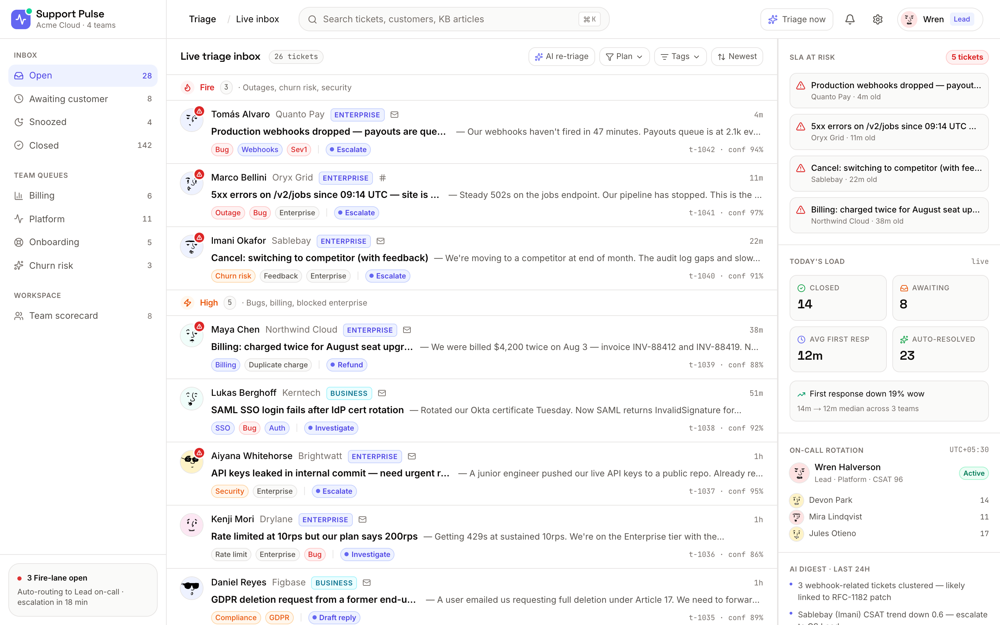
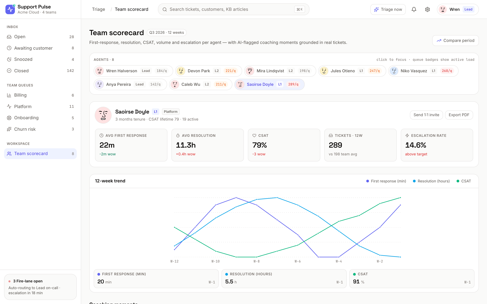
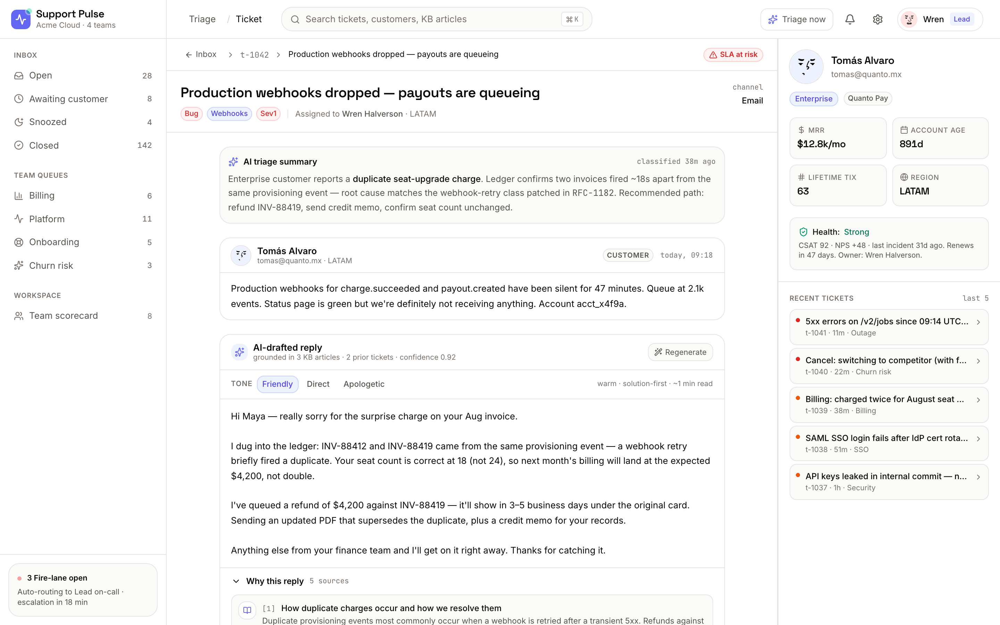

# Support Pulse

> AI ticket triage and drafted replies for SaaS support teams.


Support Pulse is a triage cockpit for SaaS support teams. Tickets are auto-classified into priority lanes (Fire / High / Normal / Low / Auto-resolved), each ticket comes with a drafted reply that cites the knowledge-base articles and prior tickets it pulled from, and a team scorecard surfaces specific coaching moments grounded in the audit log.

## Run locally

```bash
npm i && npm run dev
```

The app boots on [`http://localhost:3001`](http://localhost:3001).

```bash
npm run build && npm run start
```

builds and serves a production bundle.

## Routes

- `/` — Live triage inbox: 28 seeded tickets across five AI-classified priority lanes, with plan-tier ribbons, AI tag chips, suggested-action chips, an SLA-at-risk panel, on-call rotation, and a 24h AI digest.
- `/ticket/[id]` — Ticket detail with full thread, customer context (plan / MRR / account age / last 5 tickets), and an AI-drafted reply card with three tone presets, inline citations, and a "Why this reply" expandable showing source documents.
- `/team` — Team scorecard for 8 agents: per-agent metrics (first response, resolution, CSAT, volume, escalation rate), a 12-week multi-line SVG trend chart, and 5 coaching moments tied to specific tickets.

## Screenshots





## Stack

Next.js 16 (App Router) · Tailwind CSS 4 · Framer Motion · lucide-react · TypeScript · Inter / Space Grotesk / JetBrains Mono via `next/font`.
